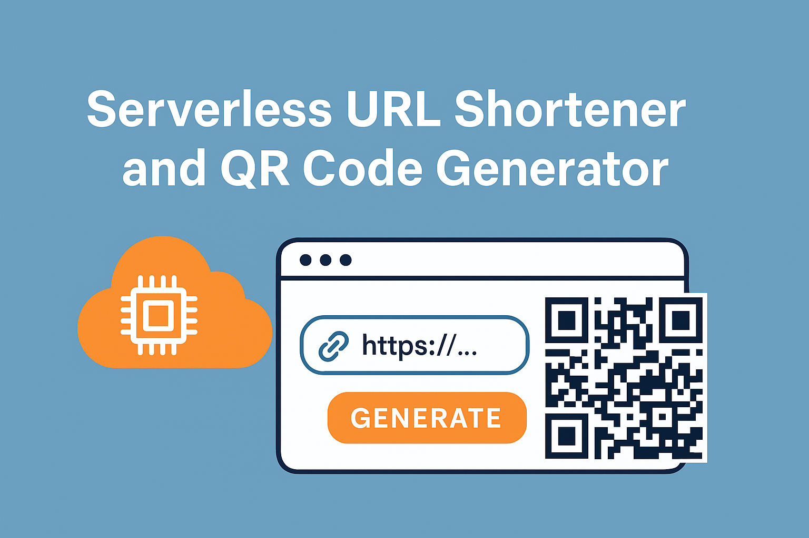

# Serverless URL Shortener and QRCode Generator 


This is a  serverless URL shortening application that is  built using  AWS services and React. This project provides functionality to generate shortened URLs and QRCodes,  and manage your shortened URLs through a user-friendly interface.

## Architecture

## AWS Services 
This project uses the following AWS services:
- **Amazon API Gateway**: For creating RESTful API endpoints
- **AWS Lambda**: For serverless function execution
- **Amazon DynamoDB**: For storing URL mappings and analytics
- **Amazon S3**: For storing the generated QRCodes images
- **Amazon CloudFront**: For Caching frequently access content
- **Amazon CloudWatch**: For logging and monitoring

The frontend of the application is built with React and communicates with the backend through Amazon API Gateway.

## Project Structure

```
url-shortener/
├── backend/   
│     └── src/     
│     │    ├── url_generator.py      # A Lambda function that uses generate_short_url.py generate a short url and stores it in DynamoDB
│     │    ├── qr_code_generator.py  # A Lambda function that uses generate_qr_code.py   generate a short url and stores it in S3
│     │    └── get_url_QRCode.py     # A Lambda function that retrieves a short url and the QRCode.
│     └── utils/
│           └── validate_url.py    # A util function to validate input urls
│           ├── generate_qr_code.py    # A util function to generate a QRCode
│           └── generate_short_url.py  # A util function to generate a short URL
│          
├── frontend/
│   ├── public/
│   └── src/
│       ├── components/           # React components
│       ├── services/             # API services
│       ├── App.js                # Main React component
│       └── index.js              # React entry point
├── infrastructure/
│   ├── template.yaml             # AWS SAM template
│   └── policies/                  # IAM policies
├── .gitignore            
└── README.md                     
```


## Deployment Instructions

### Step 1: Set Up the DynamoDB Table

1. Log in to the AWS Management Console
2. Navigate to DynamoDB
3. Create a new table with the following settings:
   - Table name: `url-shortener`
   - Partition key: `shortId` (String)
   - Sort Key: `createdAt` (String ,ISO format)
   other attributes that will be added during item creation include,
      1.originalUrl: String
      2. shortUrl: String
      3. description: String
      4. clicks: Number
4. Add a Global Secondary Index (GSI):
   - Index name: `originalUrl-index`
   - Partition key: `originalUrl` (String)
   - Projection type: ALL


### Step 2: Create the Lambda Functions

#### Create Short URL Lambda Function

1. Navigate to AWS Lambda in the console
2. Create a new function:
   - Name: `create-short-url`
   - Runtime: Python 3.9
   - Create a new role with basic Lambda permissions
3. Upload the code from `backend/create_short_url.py`
4. Set the environment variables:
   - `TABLE_NAME`: url-shortener
   - `BASE_URL`: Your API Gateway URL (after deploying API Gateway)

#### Redirect URL Lambda Function

1. Create another Lambda function:
   - Name: `redirect-url`
   - Runtime: Python 3.9
   - Create a new role with basic Lambda permissions
2. Upload the code from `backend/redirect_url.py`
3. Set the environment variable:
   - `TABLE_NAME`: url-shortener

#### Get URL Stats Lambda Function

1. Create another Lambda function:
   - Name: `get-url-stats`
   - Runtime: Python 3.9
   - Create a new role with basic Lambda permissions
2. Upload the code from `backend/get_url_stats.py`
3. Set the environment variable:
   - `TABLE_NAME`: url-shortener

### Step 3: Set Up API Gateway

1. Navigate to API Gateway in the AWS console
2. Create a new REST API:
   - Name: `url-shortener-api`
   - Description: API for the URL shortening service

3. Set up resources and methods:
   
   a. Create Short URL:
   - Create resource: `/urls`
   - Create method: `POST`
   - Integration type: Lambda
   - Lambda function: `create-short-url`
   - Enable CORS
   
   b. Redirect URL:
   - Create resource: `/{shortId}`
   - Create method: `GET`
   - Integration type: Lambda
   - Lambda function: `redirect-url`
   
   c. Get URL Stats:
   - Create resource: `/stats/{shortId}`
   - Create method: `GET`
   - Integration type: Lambda
   - Lambda function: `get-url-stats`
   - Enable CORS

4. Deploy the API:
   - Stage name: `prod`
   - Description: Production stage

5. Note the Invoke URL - you'll need it for the frontend

### Step 4: Set Up IAM Permissions

1. For each Lambda function, navigate to the function's Configuration tab
2. Go to Permissions and click on the execution role
3. Add the following inline policy:

```json
{
    "Version": "2012-10-17",
    "Statement": [
        {
            "Effect": "Allow",
            "Action": [
                "dynamodb:PutItem",
                "dynamodb:GetItem",
                "dynamodb:UpdateItem",
                "dynamodb:Query"
            ],
            "Resource": [
                "arn:aws:dynamodb:YOUR_REGION:YOUR_ACCOUNT_ID:table/url-shortener",
                "arn:aws:dynamodb:YOUR_REGION:YOUR_ACCOUNT_ID:table/url-shortener/index/*"
            ]
        }
    ]
}
```

### Step 5: Deploy the Frontend

1. Navigate to the `frontend` directory
2. Create a `.env` file with the following content:
```
REACT_APP_API_URL=https://your-api-id.execute-api.region.amazonaws.com/prod
```
3. Install dependencies:
```bash
npm install
```
4. Build the application:
```bash
npm run build
```
5. Deploy to a static hosting service like S3 or Netlify:
```bash
# Example for S3
aws s3 sync build/ s3://your-bucket-name
```

## Using the Application

### Creating Short URLs
1. Enter a long URL in the input field
2. Click "Shorten URL"
3. The shortened URL will appear in the list below
4. Click "Copy" to copy the URL to your clipboard

### Tracking Analytics
1. Click "Stats" next to any shortened URL
2. View the original URL, created date, and click count

### Managing URLs
- All your shortened URLs are saved in your browser's local storage
- Click "Clear All" to remove all saved URLs

## Backend API Reference

### Create Short URL
- **Endpoint**: `POST /urls`
- **Request Body**:
```json
{
  "url": "https://example.com/long/url/to/shorten"
}
```
- **Response**:
```json
{
  "originalUrl": "https://example.com/long/url/to/shorten",
  "shortUrl": "https://short.example.com/abc123",
  "shortId": "abc123",
  "clicks": 0
}
```

### Redirect to Original URL
- **Endpoint**: `GET /{shortId}`
- **Response**: 302 Redirect to the original URL

### Get URL Statistics
- **Endpoint**: `GET /stats/{shortId}`
- **Response**:
```json
{
  "shortId": "abc123",
  "originalUrl": "https://example.com/long/url/to/shorten",
  "createdAt": "2025-04-19T15:30:00.000Z",
  "clicks": 42
}
```

## Customization Options

### URL Expiration
Add a TTL attribute to the DynamoDB table to automatically expire URLs after a certain time.

### Custom Domains
Set up a custom domain for your API Gateway in API Gateway > Custom Domain Names.

### User Authentication
Implement Amazon Cognito to track URLs by user and provide private URLs.

## Troubleshooting

### Missing Dependencies
1. [ERROR] Runtime.ImportModuleError: Unable to import module 'lambda_function': No module named 'pyshorteners'
description: {
  "errorMessage": "Unable to import module 'lambda_function': No module named 'pyshorteners'",
  "errorType": "Runtime.ImportModuleError",
  "requestId": "",
  "stackTrace": []
}


- Solution: 

1. Create a directory and install dependencies:
```bash
mkdir package
pip install -r requirements.txt -t package/
```

2. Add your function code to the package directory

3. Create a zip file:
```bash
cd package
zip -r ../deployment-package.zip .
```

4. Upload the zip file to Lambda

### CORS Issues
If you're experiencing CORS issues:

1. Ensure CORS is enabled on all API Gateway resources
2. Add the following headers to your Lambda responses:
```
'Access-Control-Allow-Origin': '*',
'Access-Control-Allow-Headers': 'Content-Type,X-Amz-Date,Authorization,X-Api-Key,X-Amz-Security-Token',
'Access-Control-Allow-Methods': 'OPTIONS,POST,GET'
```

## Performance Considerations

- DynamoDB read/write capacity: Start with on-demand capacity for simplicity
- API Gateway caching: Enable if you expect high volume of repeat requests
- CloudFront: Consider adding CloudFront in front of API Gateway for better performance

## Security Considerations

- Validate input URLs to prevent security issues
- Consider adding rate limiting to prevent abuse
- Implement CloudWatch alarms for unusual traffic patterns


# REF
1. https://kinsta.com/blog/url-shortener-with-python/
2. https://docs.aws.amazon.com/lambda/latest/dg/python-layers.html
3. https://github.com/awsdocs/aws-lambda-developer-guide/tree/main/sample-apps/layer-python
4. https://docs.aws.amazon.com/lambda/latest/dg/python-package.html


# CHALLEMGES ERRORS
1. [ERROR] Runtime.ImportModuleError: Unable to import module 'lambda_function': No module named 'pyshorteners'
description: {
  "errorMessage": "Unable to import module 'lambda_function': No module named 'pyshorteners'",
  "errorType": "Runtime.ImportModuleError",
  "requestId": "",
  "stackTrace": []
}
- Solution: Use


## License

This project is released under the MIT License.
